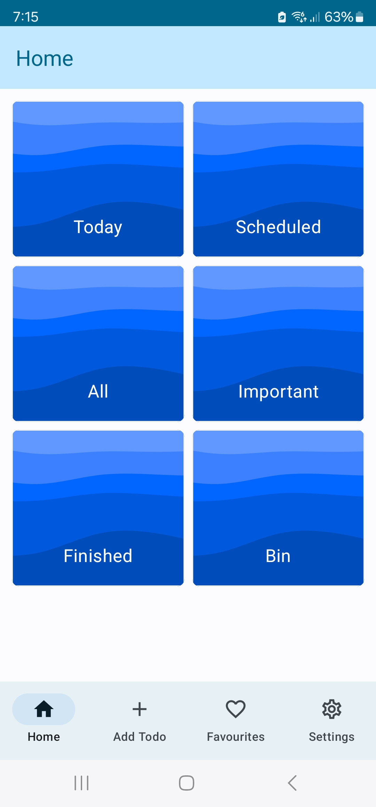
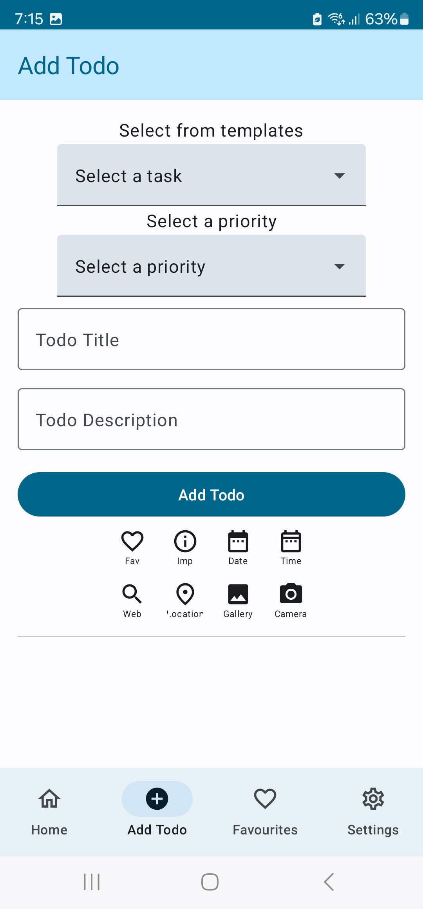
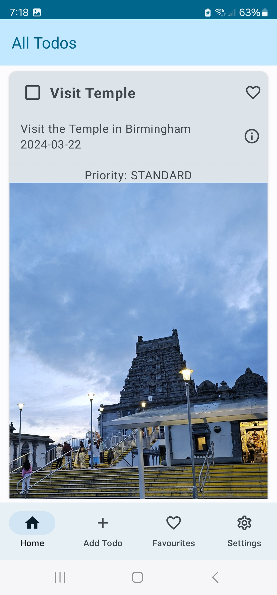

# ✅ Advanced Android Todo App

A **feature-rich Todo application** built with **Kotlin** and **Jetpack Compose**, designed to go beyond basic task management.  
The app integrates **multimedia support**, **geolocation features**, and **modern Android architecture**, making it a practical yet experimental project for exploring advanced mobile development.  

---

## 🎯 Project Overview
This project is more than just a checklist app.  
It demonstrates **scalable Android app design** using clean architecture, modern UI components, and integration with device capabilities.

Key highlights:
- 📝 **Task Management** – Create, update, delete, and categorize todos.  
- 📎 **Multimedia Support** – Attach images, audio notes, and files to tasks.  
- 📍 **Geolocation Integration** – Tag tasks with location data for context-aware reminders.  
- 🔔 **Smart Notifications** – Deadline and location-based alerts.  
- 🎨 **Modern UI** – Built entirely with Jetpack Compose for a responsive and fluid experience.  
- 💾 **Offline-First** – Local database with sync-ready structure for future cloud integration.  

---

## 🛠️ Tech Stack
- **Language:** Kotlin  
- **UI:** Jetpack Compose  
- **Database:** Room (SQLite)  
- **Dependency Injection:** Hilt  
- **Architecture:** MVVM (Model-View-ViewModel)  
- **Other:** Coroutines, LiveData/Flow, Google Maps API  

---

## Todo App for Android
This project led to the development of a feature-rich Todo app for Android, built using Kotlin and Jetpack Compose with the MVVM architecture. The app seamlessly integrates multimedia and geolocation features for efficient task management. Highlights include streamlined task creation, customizable templates, and geofencing capabilities, resulting in an intuitive tool for enhanced productivity on the go.

---

## 📚 Learning Outcomes

This project showcases:

- Hands-on experience with Jetpack Compose and modern UI patterns.

- Using Kotlin Coroutines and Flow for asynchronous programming.

- Integrating device services like multimedia and location into Android apps.

- Building scalable apps with clean architecture and DI.

---

## 📸 Screenshots / Demo  

    
    
    

